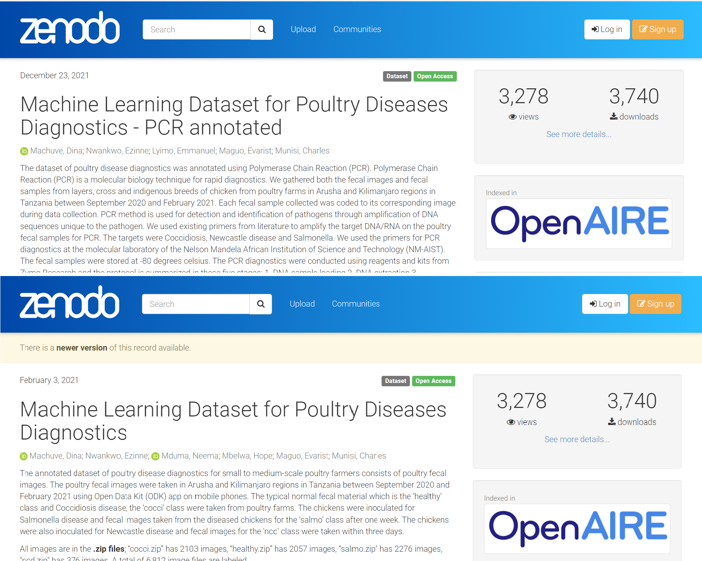
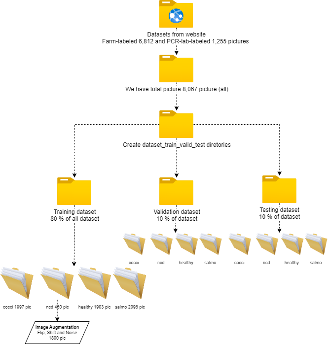

# Poultry Disease Classification

## Executive Summary
We get the datasets from the [Machine Learning Dataset 1](https://zenodo.org/record/5801834#.Y3MAC3ZBy8U) and [Machine Learning Dataset 2](https://zenodo.org/record/4628934#.Y3MA6HZBy8U). This is a series of information about poultry disease diagnostics was annotated using Polymerase Chain Reaction (PCR) and the farm-labeled fecal image.The poultry fecal images were taken in Arusha and Kilimanjaro regions in Tanzania between September 2020 and February 2021.

It is necessary to divide the data into the respective directories in order to support images for Artificial Neural Network learning using Keras and Tensorflow tools:
**Train subdirectory** is data to use for neural network learning to find optimal weight and make architecture, **Validation subdirectory** is data to make sure the neural network model is not overfitting with training datasets and **Testing subdirectory** is data to make final capability with our model. Due to ncd class in the train subdirectory finding an imbalance problem between another group, we decide to use image aumentation to increase image in this class such as flip, shiftandrotate, and add noise and contrast. Finally, we prepared data suitable for training deep learning model using by TensorFlow and Keras.
